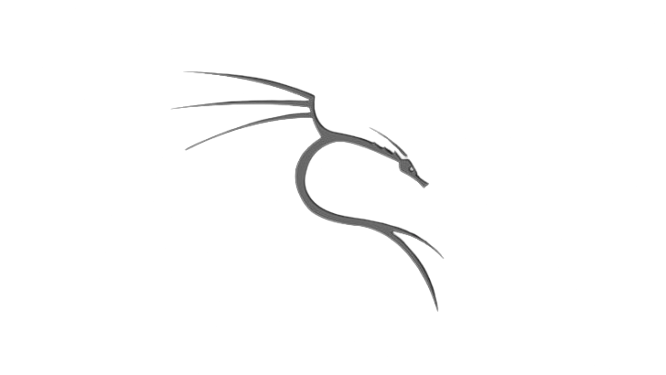

#  Ｌｅｖｉｏｎ  Ｋｅｒｎｅｌ

**Levion is a battery-first kernel (60/40 balance) with full NetHunter support.**
Tuned for longer screen-on time, cooler idle temps, and a snappier device — for Internal Injection 😜

---

## ⚠️ Disclaimer

Flashing a custom kernel will not void your warranty, but there is always a risk of bricking your device. Please make sure to:
- 💾 Back up your data and your stock **boot.img**, **vendor_boot.img** and **vendor_dlkm.img**
- 🧠 Understand the features in this kernel before flashing it
- ✅ Tested on **LineageOS 23.2 (Android 16)** only — other ROMs are not guaranteed

- I am **not responsible** for bricked devices, damaged hardware, or any issues that arise from using this kernel.

- By flashing this kernel, **YOU** are choosing to make these modifications. If something goes wrong, **do not blame me**!

# **🚨 Proceed at your own risk!**

---

## ✨ Features

Levion is a battery-first kernel (60/40 balance) with full NetHunter support.
Tuned for longer screen-on time, cooler idle temps, and a snappier device — for Internal Injection 😜

#### ⚡ Performance & Scheduler
- 🧠 **CASS**: Capacity Aware scheduler for smart, efficient task placement
- 🚀 **BORE v5.1.0**: burst-oriented scheduler for a snappier UI
- 🎚️ **uclamp**: per-task min/max performance clamping
- ⏱️ **PELT half-life 16ms**: load tracking reacts ~2x faster for a more responsive feel
- 🔧 **iowait boost fix**: storage-driven frequency boosts now respect uclamp limits
- 🎮 **Adrenoboost**: adjustable GPU boost for smoother gaming — `/sys/class/kgsl/kgsl-3d0/devfreq/adrenoboost` (0–3)
- 🔋 **Power-Efficient Workqueues**: background work parked on idle CPUs to save battery
- 🛠️ **Curated YAKT tweaks**: scheduler/VM defaults tuned for daily-driver smoothness

#### 🔋 Battery & Charging
- ⚡ **USB Fast Charge**: up to **900mA** in USB 2.0 mode, **on by default** — `echo 0 > /sys/kernel/fast_charge/force_fast_charge` to disable

#### 💾 Memory & Storage
- 🗜️ **ZRAM + LZ4**: fast compressed swap in RAM
- 💽 **NTFS3**: full read/write for NTFS drives over USB-OTG
- ⚡️ **TMPFS XATTR / POSIX ACL**: extended attribute support

#### 🌐 Network
- 🌐 **BBR v3**: Google's latest congestion control for better throughput & latency
- 🚦 **FQ Codel**: fair queuing that kills bufferbloat under load
- 📶 **MPTCP**: use Wi-Fi + Mobile data together
- 🧱 **nftables + ipset + IPv6 NAT**: modern firewall stack

#### 🔐 Root & Security
- 🔐 **KernelSU Next v3.2.0**: modern kernel-mode root
- 🥷 **SUSFS v2.1.0**: addon root-hiding patches for better app compatibility (banking, etc.)
- 🛡️ **Baseband Guard**: lightweight LSM protecting critical partitions (modem, bootloader, vbmeta…) from accidental format/tamper
- ✅ **SELinux stays enforcing**: no permissive downgrade

---

##  Kali NetHunter Edition

A separate **NetHunter** build (`nethunterv2` branch) adds wireless pentesting support on top of every feature above.

- 📡 **External Wi-Fi adapters**: RTL8812AU, RTL8814AU, RTL8188EUS, RTL8xxxu & RTW88 drivers
- 🛰️ **Monitor mode + injection (external)**: full monitor mode with frame & packet injection on supported USB adapters
- 📶 **qcacld3 Injection Mode**: internal wireless pentesting straight from the built-in Wi-Fi (WCN3990) — no external adapter needed
- ᚼᛒ **Bluetooth USB adapters**: including the TP-Link UB500
- 📻 **SDR support**: HackRF, RTL-SDR, Airspy, MSI2500
- 🔌 **RNDIS USB**: USB tethering / networking gadgets
- 🗂️ **Network file sharing**: mount remote shares
- 🧰 **Raw sockets & unrestricted ports**: for tools that need low-level network access

> ⚠️ **Hardware restriction:** unicast broadcasting is unavailable in **qcacld3 injection mode** (a WCN3990 limitation).

> Flash the **NetHunter** build only if you use Kali NetHunter — regular users should stick to the standard build.

---

## 📋 Installation

- 📲 **Kernel Flasher app**: flash with the **[Kernel Flasher](https://github.com/capntrips/KernelFlasher)** app
- ♻️ **Recovery**: `adb sideload ./levion_kernel.zip`

Then reboot. Need root? Install the matching **[KernelSU Next](https://kernelsu-next.github.io/webpage/)** manager app after flashing. You can also find installation instructions in the release notes.

---

## 💬 Support

If you encounter any issues or need help, feel free to:
- 🐛 Open an issue with a clear description, steps to reproduce, relevant logs (`dmesg`, `last_kmsg`, `logcat`), and your ROM + kernel build version
- 💬 Reach out directly

---

## 🌟 Special Thanks

**These amazing people help make this project possible! ❤️**

| 🔧 **Contribution** | 👨‍💻 **Developer** | 🔗 **Link** |
|:---------------:|:----------------:|:-----------:|
| **BBR + FQ Codel & qcacld3 patches** | Madara273 |  |
| **Kernel Tweaks** | bcrtvkcs |  |
| **KernelSU-Next** | rifsxd |  |
| **SUSFS** | simonpunk |  |
| **Baseband Guard** | vc-teahouse |  |

### 💖 Huge thanks to **[@Madara273](https://github.com/Madara273)** ❤️

*If you have contributed and are not listed here, please remind me!* 🙏

---

### ⚡ **Built for the OnePlus 9 / 9 Pro — fast, rooted, and pentest-ready.** ⚡

